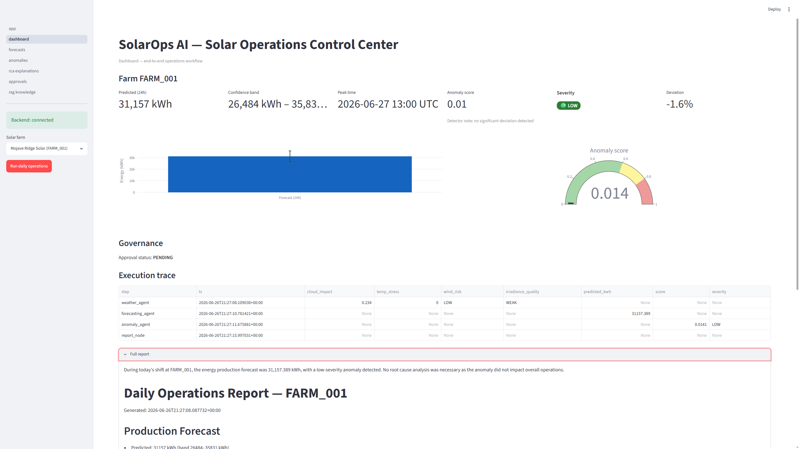
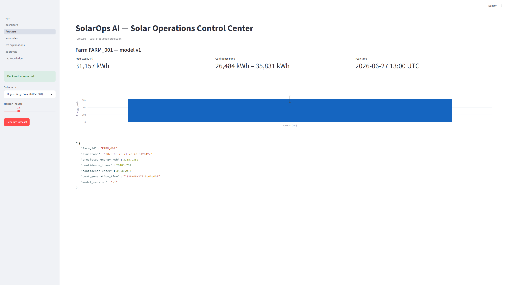
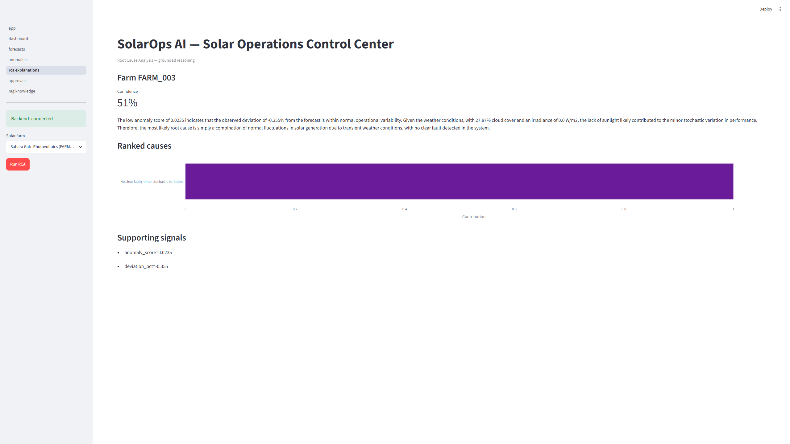
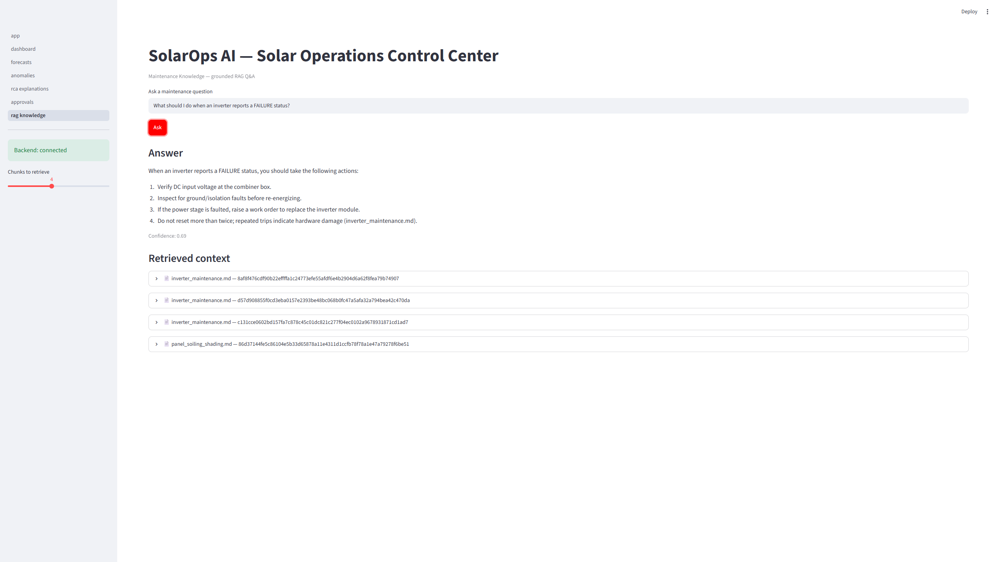

# ☀️ SolarOps AI — Agentic Solar Farm Intelligence Platform

A production-grade, modular AI system for operating utility-scale solar farms. It
forecasts generation, detects performance anomalies, explains their root cause,
grounds maintenance guidance in approved manuals, and gates critical actions
behind human approval — coordinated by a LangGraph multi-agent orchestrator.

> **Runs fully offline.** Every heavy/optional dependency (LLM, LangGraph, vector
> DB) has a deterministic fallback. No API keys are required to run, test, or demo
> the system. Real backends are used automatically when configured.

---

## 🎯 Capabilities

| Capability | Implementation |
| --- | --- |
| **Generation forecasting** | LightGBM on engineered temporal + weather features (`SolarForecast` with confidence bounds). |
| **Anomaly detection** | Weather-adjusted performance-ratio deviation + inverter health, scored with an IsolationForest. |
| **Root cause analysis** | LLM reasoning (with deterministic fallback) over the anomaly signature → ranked causes. |
| **RAG knowledge** | Semantic retrieval over maintenance manuals, grounded answers with citations. |
| **Human-in-the-loop** | HIGH-severity findings open a blocking approval gate with a full decision audit trail. |
| **Orchestration** | LangGraph `StateGraph` threading a typed `SystemState` through every agent. |

---

## 🏗️ Architecture

```
            +---------------------- Orchestrator (LangGraph) ----------------------+
            |  weather -> forecast -> anomaly -> [rca?] -> report -> [hitl gate?]   |
            +----------------------------------------------------------------------+
                 |            |            |            |            |
   Weather Agent |   Forecasting Agent |  Anomaly Agent |  RCA Agent |  HITL Agent
        |                |                |                |             |
   weather_service  forecast_service  anomaly_service  rca_service  approval_service
        |                |                |                |
        +------- Synthetic data engine (deterministic, physics-lite) -+

FastAPI (REST, /api/v1)  <--  Streamlit console (presentation-only, via API client)
```

Layered, strictly separated:

- **`backend/app/`** — API (routes only), services (business logic), core
  (config/logging/security), db (repositories), models (Pydantic schemas — the
  **single source of truth** for all data contracts).
- **`agents/`** — one isolated module per agent; communicate only via `SystemState`.
- **`ml/`** — features, training, inference, evaluation (training separated from inference).
- **`rag/`** — ingestion, indexing, retrieval, generation.
- **`workflows/`** — LangGraph state + graph definitions.
- **`streamlit_app/`** — presentation only; all HTTP goes through one API client.

See [`docs/agent_design.md`](docs/agent_design.md),
[`docs/domain_overview.md`](docs/domain_overview.md), and
[`docs/failure_modes.md`](docs/failure_modes.md) for the design rationale.

---

## 💻 Quickstart (local, no Docker)

Requires Python 3.12+.

```bash
# 1. Install dependencies
pip install -r requirements.txt

# 2. (optional) configure - defaults run fully offline with mocks
cp .env.example .env

# 3. Seed data + build the RAG index, then train models (auto-trains on first
#    use too, so this step is optional)
export PYTHONPATH=.
bash scripts/load_data.sh
bash scripts/train_models.sh

# 4. Run the backend (port 8000)
bash scripts/run_backend.sh

# 5. In another shell, run the Streamlit console (port 8501)
bash scripts/run_streamlit.sh
```

On Windows PowerShell, set the path with `$env:PYTHONPATH='.'` and run the
underlying `python -m ...` commands directly, or use the `make` targets under
Git Bash / WSL.

Open the console at <http://localhost:8501> and the API docs at
<http://localhost:8000/docs>.

### Make targets

```bash
make install     # install dependencies
make data        # seed farms + build RAG index
make train       # train forecasting + anomaly models
make backend     # run FastAPI
make frontend    # run Streamlit
make test        # run the test suite
make docker-up   # build + run the full stack
```

---

## 🐳 Quickstart (Docker)

```bash
docker compose up --build
```

This starts the backend, the Streamlit console, and an nginx reverse proxy.
Open <http://localhost> (proxy), <http://localhost:8501> (console direct), or
<http://localhost:8000/docs> (API).

---

## 🔌 REST API (`/api/v1`)

| Method & path | Purpose |
| --- | --- |
| `GET /health` | Liveness/readiness probe. |
| `GET /farms` | List the farm registry. |
| `POST /forecast` | `{farm_id, horizon_hours}` -> generation forecast. |
| `POST /anomaly` | `{farm_id}` -> anomaly detection result. |
| `POST /rca` | `{farm_id}` -> ranked root-cause analysis. |
| `POST /report` | `{farm_id}` -> run the report node. |
| `GET /report/{farm_id}` | Latest report for a farm. |
| `POST /pipeline/run` | `{farm_id}` -> run the full orchestrated pipeline. |
| `GET /approvals` | Pending approval requests. |
| `GET /approvals/all` | All approval requests (audit). |
| `POST /approvals/decision` | `{request_id, decision, reviewer, notes}`. |
| `POST /rag/query` | `{query, top_k}` -> grounded answer with citations. |

All responses use a standard envelope: `{status, data, error, timestamp}`.

Example:

```bash
curl -s -X POST http://localhost:8000/api/v1/anomaly \
  -H 'content-type: application/json' -d '{"farm_id":"FARM_002"}'
```

---

## 📊 How anomaly detection works

The system compares **actual SCADA output** against the **weather-expected
(physics) baseline** at the daytime peak-generation hour — the standard
performance-ratio approach used in real solar O&M:

```
deviation = (expected_kWh - actual_kWh) / expected_kWh
```

The IsolationForest scores a **scale-invariant** vector (relative deviation +
inverter health), so:

- A healthy farm under any weather -> low deviation -> **LOW** severity.
- A faulted farm (degraded/failed inverter) -> large deviation -> **HIGH**
  severity, which triggers RCA and opens the human-in-the-loop approval gate.

Detection is deterministic and wall-clock independent. Severity bands:
`>= 0.8 HIGH`, `>= 0.6 MEDIUM`, else `LOW`.

---

## 📸 Screenshots

| | |
|---|---|
| **📊 Dashboard – Daily Operations Workflow**<br/>Real-time view of farm status, forecast vs actual, anomaly severity, and the full audit trail.<br/><br/> | **📈 Forecasts – Production Prediction**<br/>Solar generation forecast with confidence bounds for the next 24 hours.<br/><br/> |
 **🔍 Root Cause Analysis – Ranked Causes**<br/>When anomalies are detected, the RCA agent ranks the probable causes with confidence scores.<br/><br/> | **📚 RAG Knowledge Base – Maintenance Q&A**<br/>Query maintenance knowledge with grounded answers and citations from the manual corpus.<br/><br/> |

---

## ⚙️ Configuration

Settings load from environment / `.env` (see [`.env.example`](.env.example)).
Key flags:

| Variable | Default | Effect |
| --- | --- | --- |
| `WEATHER_USE_MOCK` | `true` | Use the deterministic mock weather provider. |
| `LLM_USE_MOCK` | `true` | Use deterministic template reasoning (no API key needed). |
| `OPENAI_API_KEY` | _empty_ | If set with `LLM_USE_MOCK=false`, real LLM reasoning is used. |
| `ANOMALY_THRESHOLD` | `0.6` | RCA trigger / MEDIUM severity threshold. |
| `BACKEND_URL` | `http://localhost:8000` | Read by the Streamlit API client. |

No secrets are ever committed; all credentials come from the environment.

---

## ✅ Testing

```bash
export PYTHONPATH=.
python -m pytest backend/tests -q
```

The suite covers the ML layer (schema-compliant forecasting, normal vs faulted
anomaly classification), the agent pipeline (orchestration, conditional RCA/HITL
routing), and the API (endpoint contracts, approval flow).

---

## 📁 Repository layout

```
backend/       FastAPI app: api - services - core - db - models - tests
agents/        weather - forecasting - anomaly - rca - hitl - orchestrator - shared
ml/            features - training - inference - evaluation
rag/           ingestion - indexing - retrieval - generation - data/manuals
workflows/     LangGraph state + graph definitions
streamlit_app/ pages - components - services (API client) - utils
configs/       app/model/agent YAML config (farm registry lives here)
infra/         docker - nginx - kubernetes - terraform
scripts/       run_backend - run_streamlit - train_models - load_data
docs/          domain_overview - failure_modes - agent_design
prompts/       root_cause - optimization
```

---

## 💡 Design principles

- **Modularity & strict layering** — no business/ML/agent logic in routes or UI.
- **Structured contracts everywhere** — Pydantic v2 schemas; no free-form dicts
  between layers; every response carries `farm_id`, `timestamp`, and confidence
  where relevant.
- **Single responsibility per agent**; agents share state, never call each other.
- **Graceful degradation** — deterministic fallbacks keep the whole system
  runnable offline and reproducible.
- **Human-in-the-loop** for any HIGH-severity or externally-impacting action,
  with a full audit trail.
- **Never fail silently** — exceptions become structured error responses; agent
  failures are captured in state, not crashes.

> **All projects here are real, deployed, and actively maintained. All the API keys are replaced with placeholders. Built with AI assistance; the designs, decisions, and deployments are mine.**